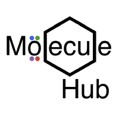

## Who am I?
I'm a software developer and data scientist with expertise in designing mathematical
software and algorithms to solve complex scientific and business challenges. 
I specialize in bridging the gap between theory and application, as well as creating 
scalable solutions to real-world problems.

## I code with

  
  
  
  
  
  
  
  
  
  
  

## Open source work/contributions

###  [MoleculeHub](https://github.com/MoleculeHub) - a collection of cheminformatics tools in Julia

###  [DataFort (In Development)](https://github.com/MoleculeHub) - dataframes in Fortran

<!-- ###  [Lux.jl](https://github.com/LuxDL/Lux.jl) - Elegant and Performant Deep Learning -->
